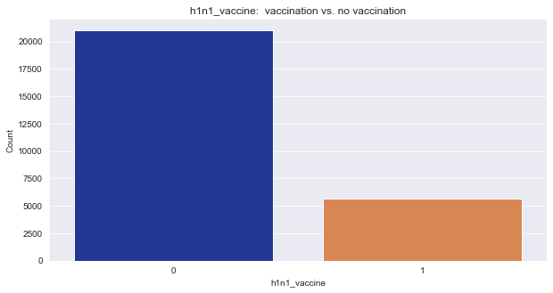
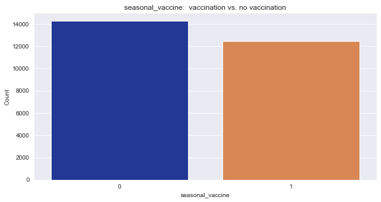
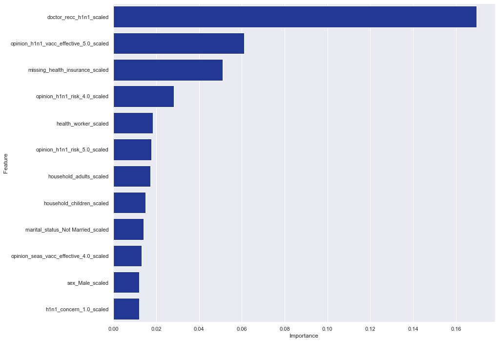
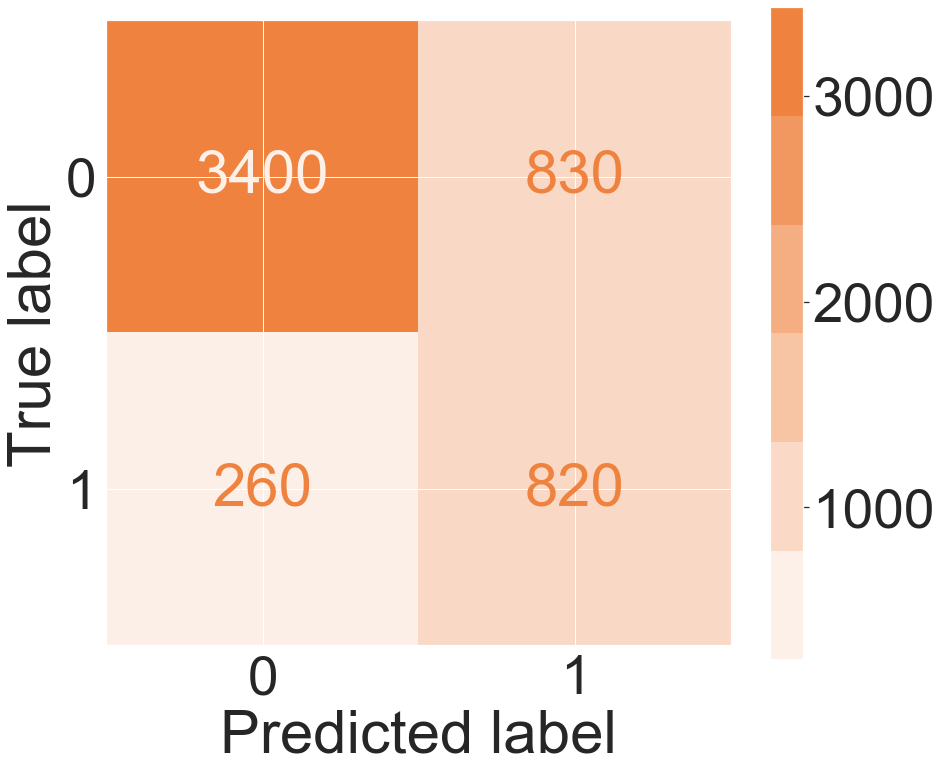
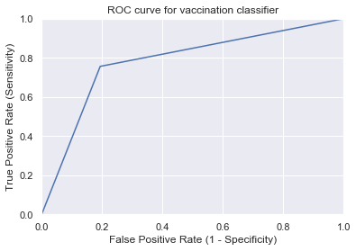
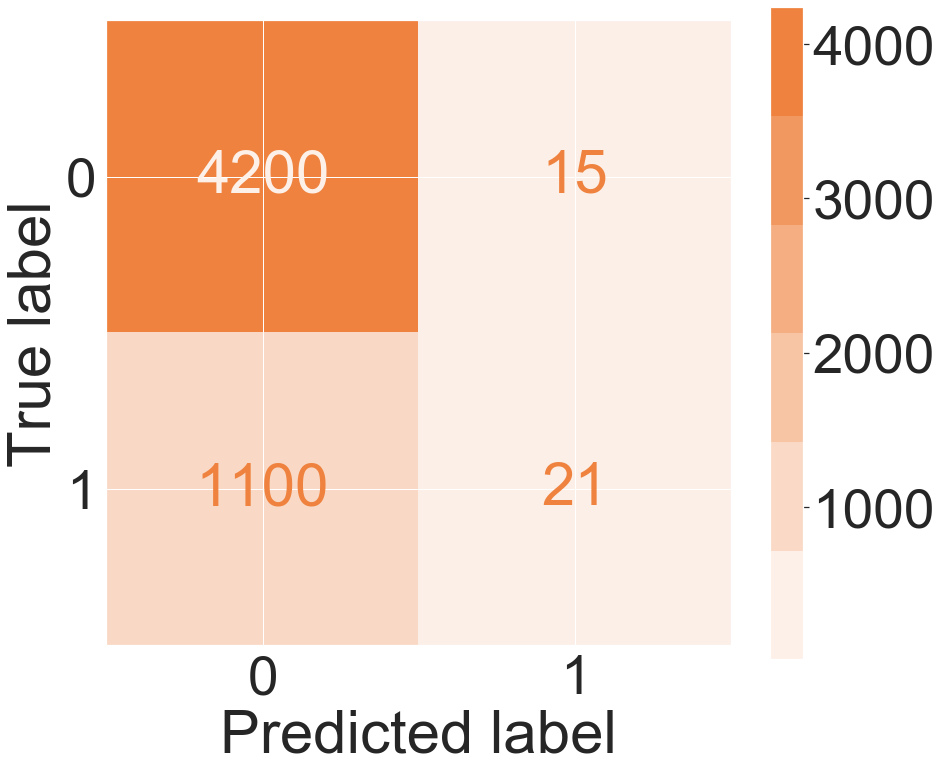
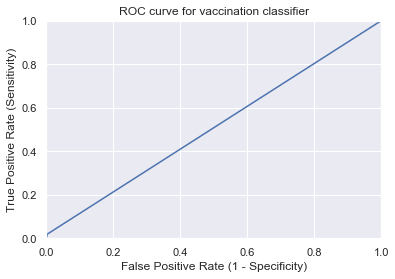
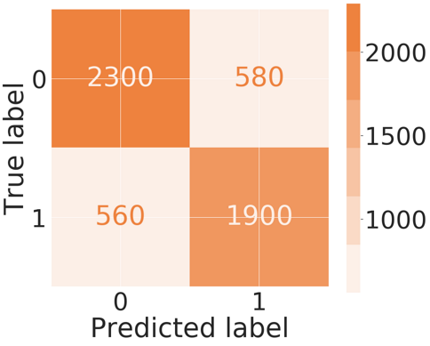
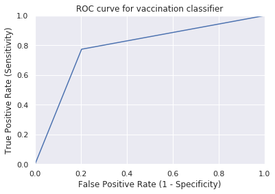

# Predicting Vaccinations

## Business Case

The U.S. Department of Health & Human Services alomg with the National Center for Health Statistics launched a national telephone survey to gather data from a sample of the U.S. population in order to make predictions about H1N1 and Seasonal Flu vaccinations.

**Target:**
  * H1N1 Vaccination: Did the survey respondant receive the vaccine or not?
  * Seasonal Flue Vaccination: Did the survey respondant receive the vaccine or not?

We have been tasked with developing a classification model to make the predictions based on the survey results.  The specific end goal has not yet been determined, as this information may have many different uses in policy making, business, and non-profit health work.  Therefore, we are keeping an open mind when modeling to determine a few different possible models that would be appropriate in different contexts.

The survey data can be found at this link: [National 2009 H1N1 Survey](https://www.drivendata.org/competitions/66/flu-shot-learning/page/210/)

## Target Review

This project contains two target variables: H1N1 Vaccination and Seasonal Flu Vaccination.  Below is a distribution of both variables.  There is a clear imbalance in the H1N1 Vaccination meaning there are far more people in the sample who did not receive this vaccine than people who did receive it.  Seasonal Flu vaccine is has a higher percentage of usage and therefore the classes are fairly well balanced.

 

## EDA, Hypothesis Testing & Feature Importance

We used EDA and the Chi-Squared test for cateogrical data comparison to determine which features appeared to have a relationship with the target variables of H1N1 and seasonal vaccinations.

We dramatically decreased our p-value to run these Chi-Squared tests to avoid false positives, so any feature with a passing p-value is strongly correlated.

There are several features with a strong correlation with the target variable, including:
  * Doctor reccomendation for seasonal vaccine
  * Opinion seasonal vaccine effectiveness
  * Opinion seasonal flu risk
  

  
## Predictive Modeling H1N1

Based on Accuracy and Area Under the Curve (AUC), our best model appears to be Logistic Regression with an accuracy of .796, a harmonic F1-Score of .781 and an Area Under the Curve of .601.

However, it is important to note that this model is very tolerant in terms of the number of false positives with a precision rate of .498 and a total of 826 false positives on the test set.  The model prioritizes false negatives with a recall of .756 and a total of 264 false negatives on the test set.

**Fasle Positives** = predicted that people did vaccinate when they didn't.

**False Negatives** = predicted that people did not vaccinate when they actually did.

The Logistic model may not be the best depending on the organizations goals.  For example, if this model is used to achieve a goal like maximizing the number of vaccinations in the population, then you may want a model that minimizes the false positives, meaning that there would be a low tolerance for predicting that someone did vaccinate when they actually did not (false positive) and higher tolerance for predicting that someone did not vaccinate when they actually did (false negative).

If this is the case, then the Support Vector Machine actully achieved a higher accuracy even though it performed the worst on the AUC metric.  Compared to the Logisitic Regression model, SVM only allowed 15 false positives but with a greater tadeoff of false negatives for a total of 1,063 on the test set.  The low C value of 0.01 means the SVM model is less tolerant of the violation, which in turn gives us a more complex model with a higher variance and a lower bias.

On the other hand, if the organizations goals is to minimize resource allocation for a direct mail marketing campaign designed to increase awareness for vaccinations, then the organization may prefer to use the Logisitic Regression model which won't predict everyone who did not vaccinate, but at least the campaign would reach the people who matter most, like the elderly.

We will leave it up to the organization to determine which trade-off they want to make based on their goals.

## Predictive Modeling Seasonal Flu Vaccine

Based on Accuracy and Area Under the Curve (AUC), our best model appears to be Logistic Regression again with an accuracy of .786, a harmonic F1-Score of .786 and an Area Under the Curve of .770.

## Next Steps & Recommendations

Since we used a broad approach for predictive modeling where we tested many different models without a lot of optimization, we would continue our work by choosing the best models and optimizing them with parameter tuning.

We recommend that the organization clarify it's goals for moving forward so we can optimize the model to meet their goals.

